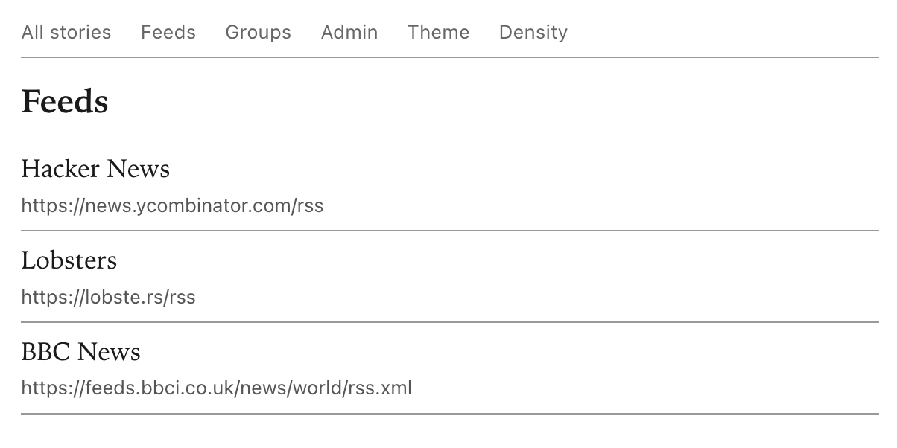

# inkwell

A small self-hosted RSS/Atom reader designed for the built-in browser
on a Kindle (or any other low-power e-ink device). inkwell
pre-extracts every article so taps render in a few hundred
milliseconds, sanitizes images for the Kindle's pickier browser, and
optionally serves the same content over the Gemini protocol.

## Get started

- [Installation](installation.md) — getting a build running, either
  from source or Docker.
- [Self-hosting](self-hosting.md) — docker-compose recipe, reverse
  proxy, backups.
- [Configuration reference](configuration.md) — every YAML field and
  environment variable, with examples.
