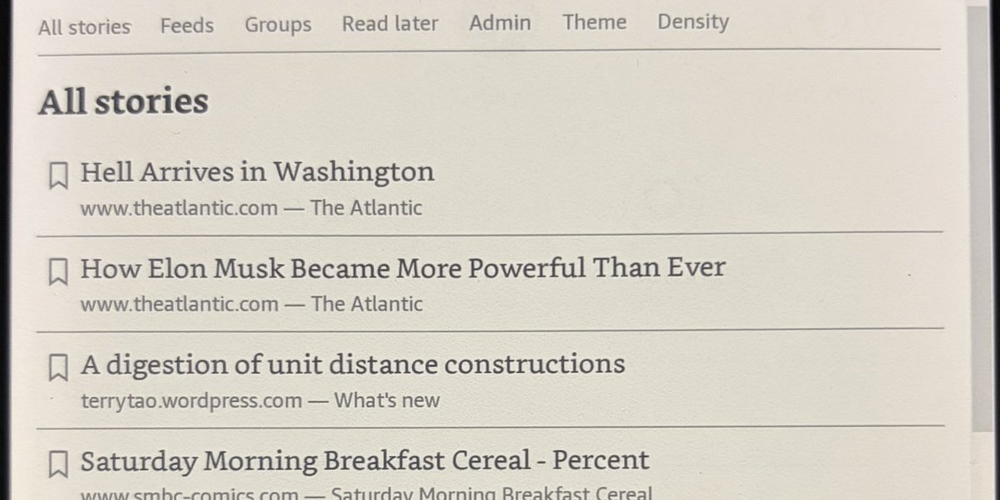

# inkwell

inkwell is a self-hosted RSS/Atom reader that serves articles as
static HTML tuned for the built-in browser on a Kindle. Background
jobs pre-extract every article and transcode every embedded image, so
a tap on the device fetches ready-to-render bytes from local disk.

  
  
  

## Documentation

- [Installation](installation.md) — build from source, run under
  Docker, first configuration.
- [Self-hosting](self-hosting.md) — docker-compose, reverse proxy,
  admin access control, backups, upgrades.
- [Reading](reading.md) — the listing, article, and read-later views,
  and their behaviour on a Kindle.
- [Admin](admin.md) — add and remove feeds and groups, import OPML.
- [Authenticating your e-reader](sidecar.md) — sign a new Kindle in
  through the auth gateway without typing on the device.
- [Configuration reference](configuration.md) — every YAML field and
  environment variable, with defaults.
